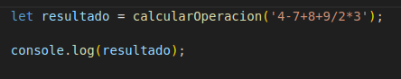
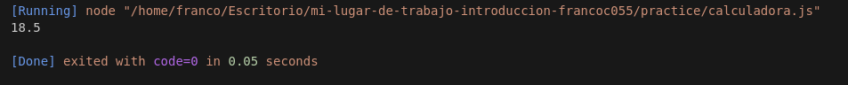

El programa se divide en 4 funciones en un orden de jerarquia, la primer funcion **"EstructurarOperacion"**, valga la redundancia, estrucutura la operacion pasada como cadena, validando si no supera los 20 caracteres,y esta devuelve un array respetando operadores y operandos. Luego se ejecuta la segunda funcion **CalcularRaizYPotencia**, calcula y resuelve si es que hay raices y potencias, y devuelve un nuevo array estrucuturado. La tercer funcion **CalcularDivisionYMultiplicacion** es similar a la anterior solo que con los operadores de multiplicar y dividir, con la validacion de no poder dividir por 0. Y por ultimo la cuarta funcion **calcularOperacion** se encarga de calcular las sumas y las restas que han quedado del array estructurado, y retorna el resultado de la operacion.

